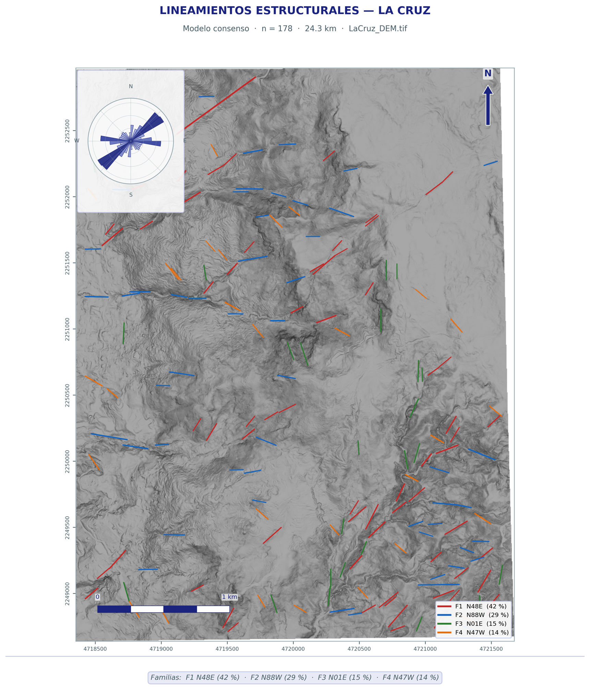
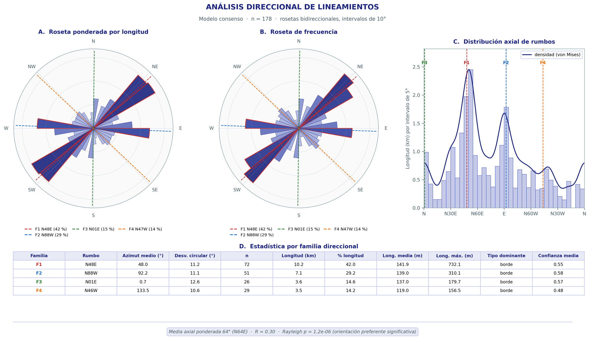
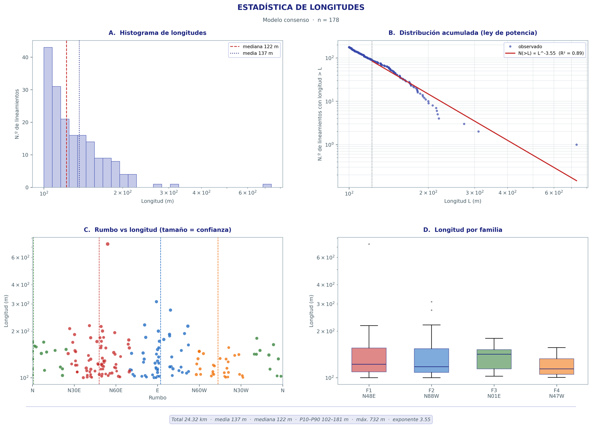
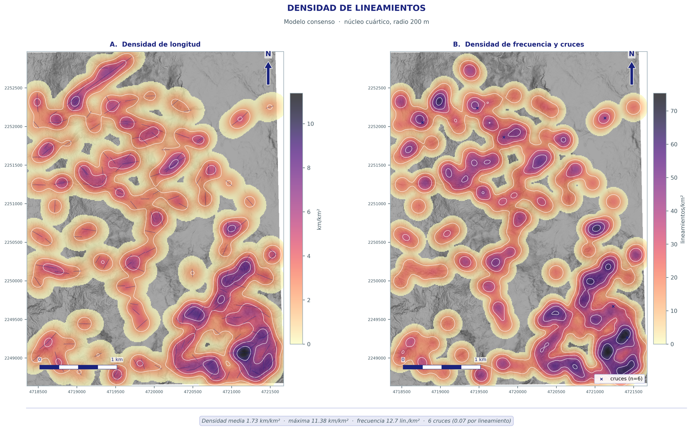
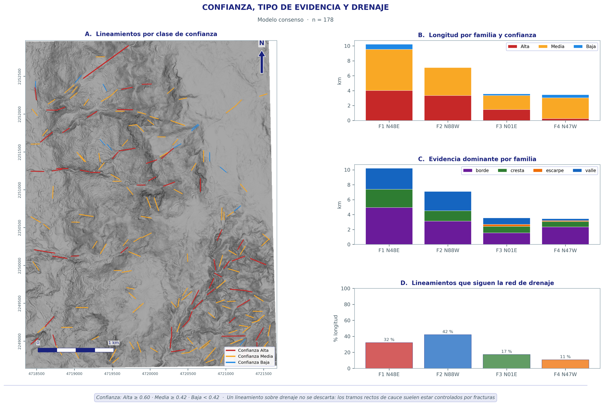
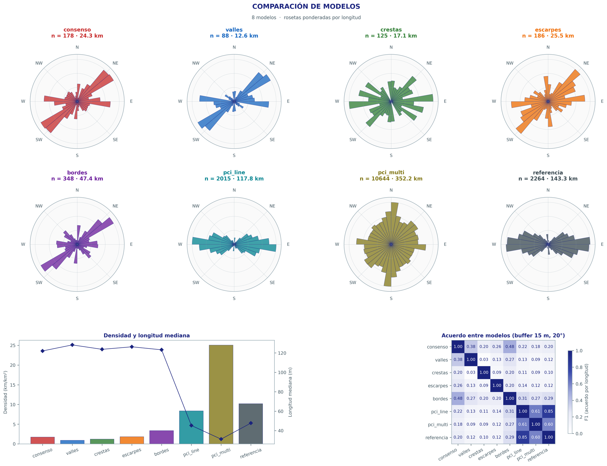
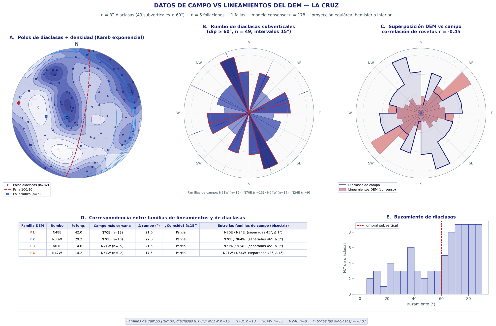

# Lineamientos PRO — Extractor automático de lineamientos geológicos

Extrae lineamientos estructurales a partir de un Modelo Digital de Elevación (DEM),
con **siete modelos en un solo programa**: un modelo de consenso multi-evidencia,
cuatro modelos de evidencia topográfica y una réplica calibrada del módulo **LINE
de PCI Geomatica** para comparar. Cada corrida genera automáticamente capas SIG,
láminas de publicación, estadística estructural y un libro de Excel.



## Descarga

| Opción | Cómo |
|---|---|
| **Ejecutable Windows** (no requiere Python) | [Descargar la última versión](https://github.com/EzequielFP/lineament-extractor-python/releases/latest). Descomprima el .zip y ejecute `LineamientosPRO.exe` |
| **Código fuente** | `git clone` este repositorio, `pip install -r requirements.txt` y doble clic en `Lineamientos_PRO.bat` |

## Por qué es mejor que PCI LINE

PCI LINE detecta bordes de brillo en **un** sombreado. Por eso depende del azimut
del sol, marca cualquier borde (textura, vías, límites del DEM) y entrega
fragmentos cortos. Lineamientos PRO:

1. **Mide la forma del relieve** directamente en el DEM: valles, crestas y
   escarpes (Hessiano multiescala), más bordes de sombreado en 8 azimuts.
2. **Aplica un filtro orientado de rectitud multi-longitud.** Un lineamiento es
   recto y continuo; los cauces sinuosos y la textura no acumulan respuesta, y
   el filtro salta los tramos erosionados.
3. **Fusiona las evidencias en un consenso**, enlaza tramos colineales y asigna
   a cada línea familia, tipo, confianza y relación con el drenaje.

**Benchmark** (6 terrenos sintéticos con fallas conocidas y cauces sinuosos
como distractores; tolerancia 8 m / 15°):

| Modelo | Precisión | Recall | F1 |
|---|---|---|---|
| **Consenso (Lineamientos PRO)** | **0,72** | **0,54** | **0,62** |
| PCI LINE con el mejor umbral posible* | 0,20 | 0,26 | 0,22 |
| PCI LINE con valores por defecto | 0,13 | 0,31 | 0,18 |

\* Umbral elegido conociendo la respuesta correcta, una ventaja que en la práctica no existe.

La **réplica de PCI LINE** se calibró contra una corrida real de PCI Geomatica
2018 (incluida en `Ejemplos/`). Entre ambas: F1 = 0,85 y correlación de rosetas
= 0,98. Puede recalibrarse con `python -m lineamientos_pro.calibrate_pci`.

---

## Guía con el ejemplo incluido (La Cruz)

### Datos de `Ejemplos/`

| Archivo | Qué es |
|---|---|
| `LaCruz_DEM.tif` | DEM de 1 m (MAGNA-SIRGAS 2018 / Origen Nacional) |
| `0.tif` | Sombreado de 8 bits usado en PCI Geomatica |
| `pci_line_original.shp` | Salida real de PCI LINE (parámetros por defecto) sobre `0.tif` |
| `datos_estructurales_lacruz.csv` | 82 diaclasas, 6 foliaciones y 1 falla medidas en campo (`id;tipo;dir_buz;buzamiento`) |

### Paso 1. Abrir el programa
Ejecute `LineamientosPRO.exe` (o `Lineamientos_PRO.bat` desde el código).

### Paso 2. Cargar los datos
En **1 · Datos** complete:
- **DEM**: `Ejemplos/LaCruz_DEM.tif`
- **Sombreado para réplica PCI**: `Ejemplos/0.tif`
- **Lineamientos de referencia**: `Ejemplos/pci_line_original.shp`
- **Datos estructurales de campo**: `Ejemplos/datos_estructurales_lacruz.csv`
- **Zona**: `La Cruz`

### Paso 3. Elegir modelos y parámetros
Preajuste **Completo** y **Resolución de trabajo = 2 m**. A 2 m un DEM LiDAR se
procesa unas 4 veces más rápido con el mismo resultado. Pulse **Ejecutar**:
tarda unos 80 s.

Para repetir exactamente esta corrida use *Cargar configuración* con
`docs/ejemplo/parametros_ejemplo.json`, o desde la línea de comandos:

```
python -m lineamientos_pro --dem Ejemplos/LaCruz_DEM.tif --preset completo --res 2 ^
  --hillshade Ejemplos/0.tif --ref Ejemplos/pci_line_original.shp ^
  --campo Ejemplos/datos_estructurales_lacruz.csv --zona "La Cruz"
```

### Paso 4. Revisar los resultados
Las pestañas **Mapa**, **Resumen** y **Figuras** muestran todo. Los botones
**Reporte HTML**, **Excel** y **Carpeta** abren los archivos. La salida completa
de este ejemplo está en [`docs/ejemplo/`](docs/ejemplo), con el
[reporte](docs/ejemplo/reporte.html), el
[Excel](docs/ejemplo/tablas/estadisticas.xlsx) y el
[GeoPackage](docs/ejemplo/lineamientos.gpkg).

#### Resumen por modelo

| Modelo | n | Longitud (km) | Mediana (m) | Densidad (km/km²) | Familias principales |
|---|---|---|---|---|---|
| **consenso** | 178 | 24,3 | 122 | 1,73 | N48E, N88W, N01E, N47W |
| valles | 88 | 12,6 | 128 | 0,89 | N49E, N87E, N51W, N01E |
| crestas | 125 | 17,1 | 124 | 1,22 | N54E, N85E, N70W, N44W |
| escarpes | 186 | 25,5 | 126 | 1,81 | N47E, N83E, N00W, N70W |
| bordes | 348 | 47,4 | 123 | 3,37 | N48E, N88E, N48W, N02E |
| pci_line (réplica) | 2015 | 117,8 | 45 | 8,38 | N88W |

La réplica de PCI entrega muchos fragmentos cortos, dominados por el rumbo E-W.
Ese rumbo es un **sesgo de iluminación** del sombreado: el sol resalta los
bordes perpendiculares a su dirección. El consenso no depende de la iluminación
y muestra como familia principal **N48E (42 % de la longitud)**, que coincide
con los grandes valles NE de la zona.

#### Lámina 02 — Análisis direccional
Rosetas por longitud y por frecuencia, histograma axial con densidad von
Mises, y tabla de familias con azimut medio, desviación circular y prueba de
Rayleigh.



#### Lámina 03 — Longitudes
Histograma, ley de potencia N(>L) ∝ L^-a (a = 3,55, R² = 0,89), rumbo vs
longitud y cajas por familia.



#### Lámina 04 — Densidad
Densidad de longitud (km/km²) y de frecuencia (lineamientos/km²) con núcleo
cuártico, más los cruces entre lineamientos.



#### Lámina 05 — Confianza, tipo y drenaje
Cada lineamiento lleva una confianza de 0 a 1. En el benchmark, la clase
**Alta** acertó el 86 % de su longitud. La lámina muestra además la evidencia
dominante y qué familias siguen la red de drenaje.



#### Lámina 06 — Comparación de modelos
Rosetas de los siete modelos y de la referencia, más la matriz de acuerdo
entre modelos.



#### Lámina 07 — Datos de campo vs DEM
Estereograma de polos de diaclasas con densidad de Kamb, falla y foliaciones.
Luego compara el rumbo de las diaclasas subverticales (≥ 60°) con el de los
lineamientos. En La Cruz, cada familia del DEM (N48E, N88W, N01E, N47W) cae
**entre** dos familias de diaclasas (N24E/N70E, N21W/N64W). Como las familias
de campo están separadas casi regularmente cada ~45°, eso indica que se
intercalan, no una relación conjugada demostrada.



---

## Salidas de cada corrida

| Archivo | Contenido |
|---|---|
| `lineamientos.gpkg` / `shp/` | Una capa por modelo con atributos: longitud, azimut, rumbo, familia, tipo, n.º de evidencias, confianza, drenaje. También incluye la capa de cruces |
| `rasters/` | Sombreado multidireccional, respuesta por modelo, densidades, red de drenaje |
| `figuras/` | 7 láminas a 300 dpi y un mapa por modelo |
| `tablas/estadisticas.xlsx` | Resumen, estadística estructural, familias, atributos, validación, acuerdo entre modelos, campo vs DEM |
| `reporte.html` | Reporte autocontenido |
| `parametros.json` | Configuración exacta, para repetir la corrida |

## Formato de los datos de campo
CSV o Excel con columnas `tipo` (diaclasa / foliacion / falla), `dir_buz`
(dirección de buzamiento; o bien `rumbo` con la regla de la mano derecha) y
`buzamiento`. Ver `Ejemplos/datos_estructurales_lacruz.csv`.

## Estructura del código

```
lineamientos_pro/   motor: evidencias, filtro de rectitud, vectorización, modelos,
                    réplica PCI, atributos, drenaje D8, estadística, láminas,
                    validación, benchmark sintético
gui_pro/            interfaz de escritorio (FastAPI + pywebview, funciona sin internet)
Ejemplos/           datos de ejemplo
docs/               manual técnico y resultados del ejemplo
build_exe.bat       genera el ejecutable con PyInstaller
```

Detalles del método, parámetros y preajustes: [docs/MANUAL_TECNICO.md](docs/MANUAL_TECNICO.md).

Comandos útiles:
```
python -m lineamientos_pro --benchmark 6                        # benchmark sintético
python -m lineamientos_pro.figures <carpeta_corrida> --campo X  # regenerar láminas
python -m lineamientos_pro.calibrate_pci imagen.tif salida_pci.shp
```
